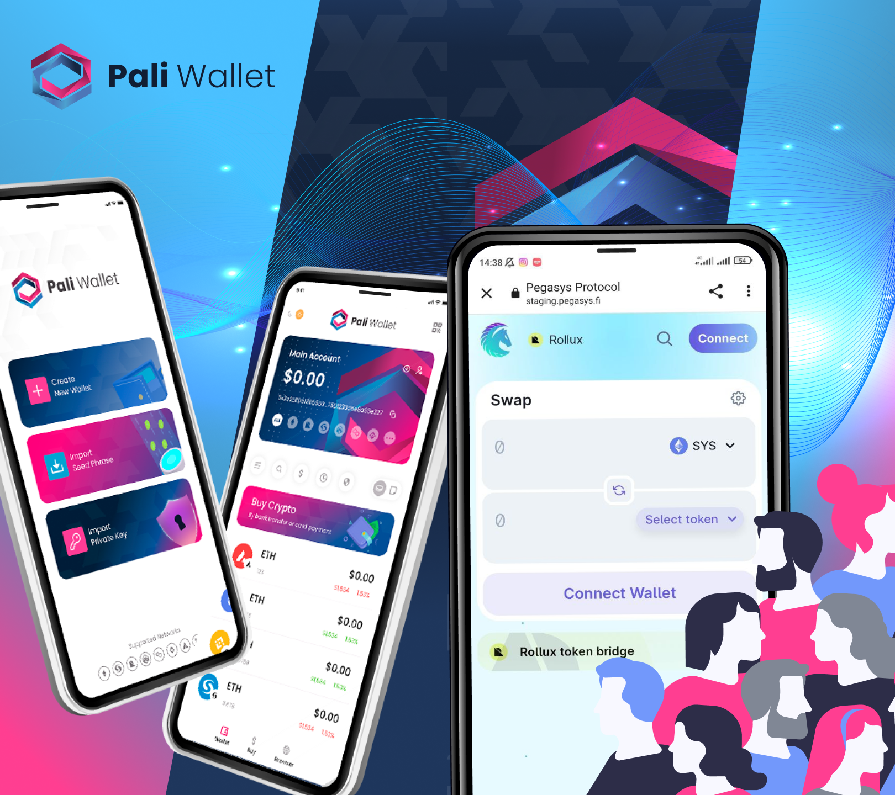

# pali-mobile

Immerse yourself in the Web3 revolution with Pali Mobile, the official Syscoin & Rollux wallet, powered by the talented minds at Pollum. Our mission? To deliver an unbeatable user experience in the realm of cryptocurrencies and decentralized applications (dapps), across all EVM-compatible chains.



## Features

• SIMPLE UX: Pali is designed with a straight-to-the-point navigation system, a minimalist interface, and pleasant components, aiming to make your journey through the cryptosphere as welcoming as possible. We consistently update and adapt our features in line with community feedback and evolving market trends, ensuring that Pali remains not just functional, but exceptional.

• FULLY AUDITED & OPEN-SOURCE: With a commitment to absolute transparency, our codebase is entirely open-source and audited, meaning you can not only trust Pali with the security of your assets, but also verify it. What's safer than that?

• FREE FOREVER: At Pali, we believe in the open ethos of the blockchain world. That's why we've ensured that our app is not just easy to use but free to use, always. Pali takes ZERO fees on services, ensuring that your transactions are as straightforward and cost-effective as possible. It's our way of fostering a truly decentralized and accessible environment.

• STATE-OF-THE-ART SECURITY: Your security is our top priority. Pali is equipped with robust security features including Face ID login, screenshot protection, and the ability to revoke token approvals. Moreover, our token security analysis is powered by the [Go Plus Security API](https://gopluslabs.io/), offering real-time insights for informed transactions.

• BUILT-IN ON/OFF RAMP: Pali seamlessly integrates with Coinify, enabling users to convert crypto into fiat currencies like USD, EUR, BRL, and more. This feature opens up a wealth of real-world possibilities, empowering you to use your digital assets in everyday transactions, from purchasing coffee to online shopping.

• NFT SUPPORT: Collect and manage your ERC721 and ERC1155 collections across chains in a streamlined interface, directly integrated with OpenSea and Luxy. We're actively expanding our support to include innovative token standards, transforming NFTs into more than just collectibles—your digital unlockables, identities, and event accesses will all find a home in Pali.

Beyond these powerful features, Pali upholds a strong commitment to user privacy and data security. We never collect personal information, ensuring your privacy remains uncompromised as you navigate the decentralized web.

Pali Mobile is designed to suit all levels of crypto expertise, with a user-friendly interface for organizing holdings, tracking market data, and personalizing your dApp interactions. It's more than a crypto wallet—it's a passport to the boundless world of Web3. Download Pali today and explore the decentralized universe like never before!

Be a part of the future, be a part of Pali 🕉️

## Links

🔗[Official Website](https://paliwallet.com/)

🎙[Discord](https://discord.gg/syscoin)

🐦[Twitter](https://twitter.com/PaliWallet)

## Build Steps

1. Set API Keys
   Pali Wallet uses several third party API like Infura and Etherscan. Before build you should set your own API keys for those services.

- `mkdir ./app/apikeys`
- `mv ./app/.env.template ./app/apikeys/.env`
- set infura_id/etherscan/polygonscan/bscscan/opensea and etc. in `./app/apikeys/.env`

2. Firebase Information

- You will need to add your own google-service.json(android) and GoogleService-info.plist(ios). You are able to get this on firebase console.

3. Build

```
cd app && yarn clean
yarn build:thread
```

4. Over-the-Air Deployment.

If you want to use over-the-air deployment, make sure to insert the API keys for Android (You can get them on appcenter.ms).
ps: We are missing the over-the-air implementation on IOS for now. Hope that they fix some library problems so we can add in the future.

For debug version:
`yarn start:android`
or
`yarn start:ios`

For release version:
`yarn build:android`
or
`yarn build:ios`

## Remember to

Install [Node.js](https://nodejs.org) **version 16**

## Addresses

### Rollux

- [TokenInfos.sol](0xAbD231AA41B691585F029Ecfd43B4B93b15b1D3a)
- [BalanceChecker.sol](0x1ACD0B3bCC084D02Fa4E9017997BaF2F4aa256F4)

## Disclaimer

Pali Mobile Copyright (C) 2023 Pollum Labs.

This program comes with ABSOLUTELY NO WARRANTY.
This is free software, and you are welcome to redistribute it under certain conditions.
Users are 100% responsible for their own digital asset custody, private key management, password storage, regulation compliance & tax reporting, according to their local juristiction. Pali doesn't collect any form of sensitive data, so our team has no mechanisms to assist users or authorities with the points outlined above.
Source code initially forked from our partners Go Pocket Wallet under GNU General Public License v3.0.
